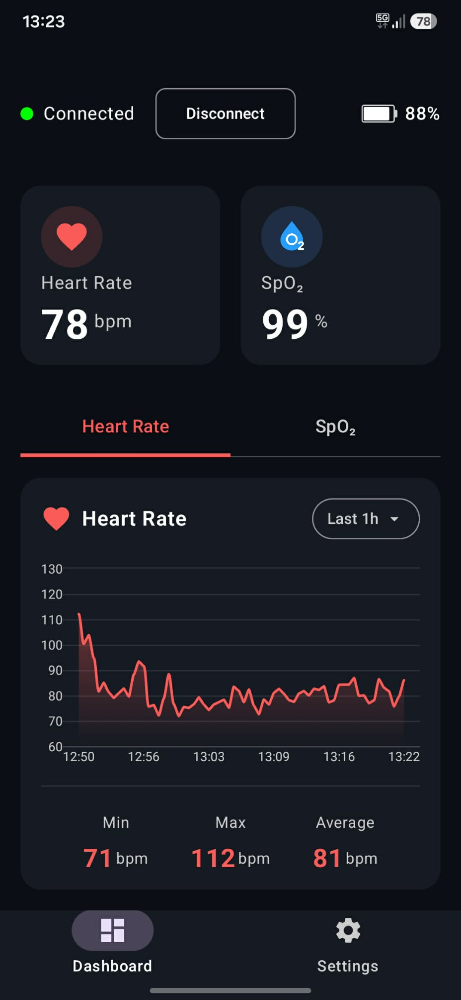
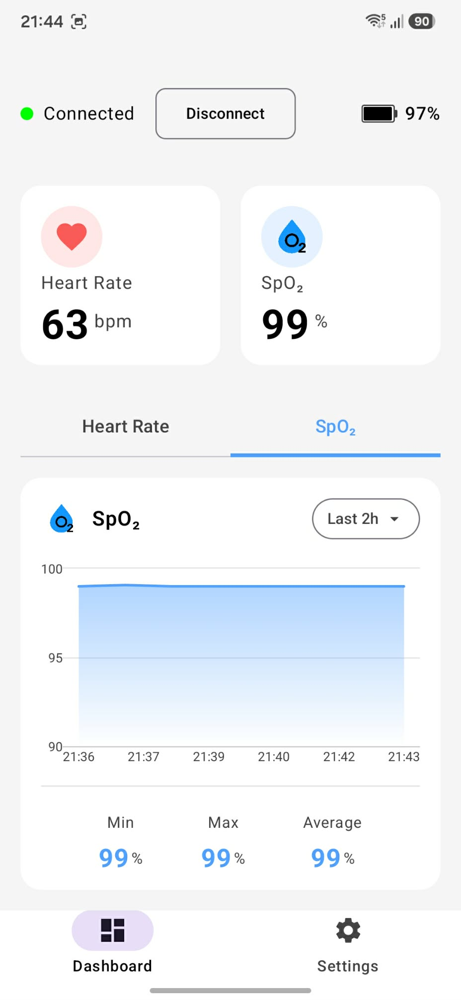

# SmartBand Mobile App

SmartBand Mobile is an Android companion application for the custom ESP32-C3-based SmartBand device.

The application connects to the wearable over Bluetooth Low Energy and displays heart rate, SpO2 and battery level in real time. Received measurements are also stored locally and can be reviewed using historical charts.

## Interface

The application supports both Light and Dark modes.

  
  &nbsp;&nbsp;&nbsp;&nbsp;
  

## Features

- BLE connection to the SmartBand wearable with service-based device discovery and connection-state handling
- real-time display of heart rate, SpO2 and device battery level
- unreliable HR and SpO2 measurements displayed as `--`
- local measurement storage using Room Database with batched database writes
- automatic removal of measurements older than 30 days
- historical HR and SpO2 line charts
- predefined history ranges: 1 h, 2 h, 5 h, 10 h, today, 7 days, 14 days and 30 days
- range-dependent time-bucket aggregation to keep historical charts readable across different time scales
- minimum, maximum and average values calculated for the selected history range
- Light and Dark mode support

## Hardware

The application is designed to work with the **SmartBand**, a custom wearable device based on the ESP32-C3.

The wearable performs heart-rate and SpO2 estimation directly on the device using PPG and accelerometer data. It includes custom sensor drivers, fixed-point signal processing, motion artifact analysis, power management and BLE communication.

The firmware and complete hardware documentation are available in the SmartBand firmware repository:

[SmartBand Firmware Repository](https://github.com/Marcin225/Wearable-firmware)

## License

This project is licensed under the MIT License.